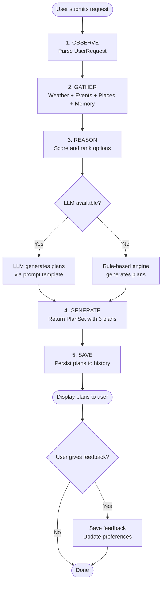
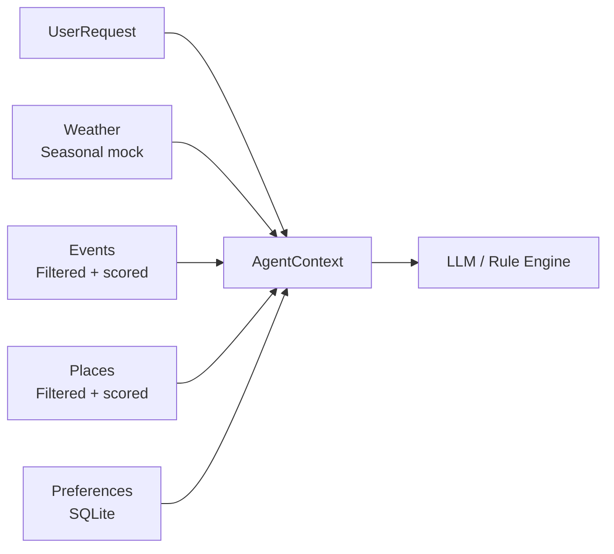
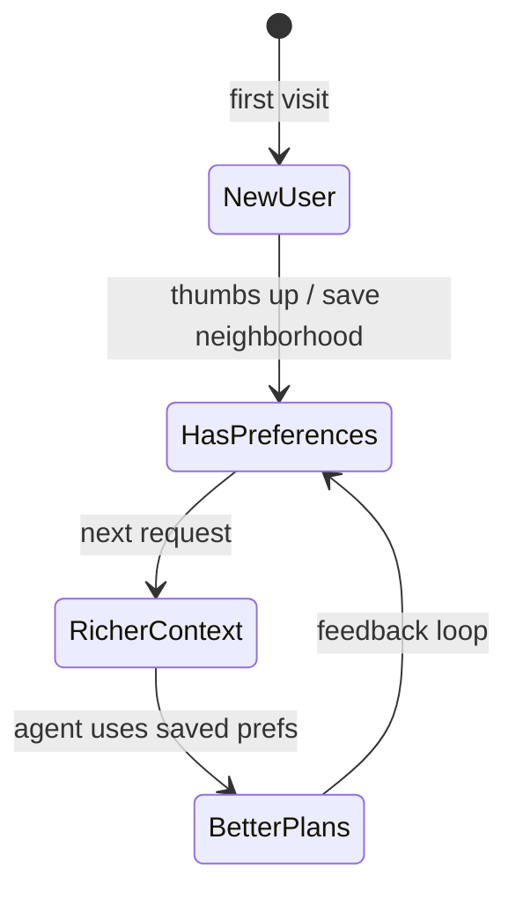

# Agent Design

## The Agent Loop

ChiLife Agent follows a five-step loop on every request. This is not a chatbot — it is a context-gathering, reasoning agent that produces structured output.

## Agent Context Assembly

Before reasoning, the agent assembles an `AgentContext` from four sources:

## Scoring Model

Events and places are scored before being passed to the reasoner. Higher scores surface the most relevant options.

| Signal | Points |
|--------|--------|
| Neighborhood match | +3.0 |
| Interest category match | +2.5 |
| Vibe match | +2.0 |
| Group context match | +1.5 |
| Energy level match | +1.0 |
| Outdoor event in bad weather | -2.0 |
| Over budget | filtered out |

## Rule-Based Plan Engine

When no LLM is available, three plan archetypes are generated:

| Plan | Strategy |
|------|----------|
| **Plan 1 — Top Pick** | Best-scored event + top-scored place |
| **Plan 2 — Dinner First** | Top restaurant → second event or bar |
| **Plan 3 — Explore** | Places/events from a different neighborhood |

This ensures variety and avoids three identical plans.

## LLM Prompt Strategy

The LLM receives a structured context block rather than a conversational prompt:

1. Current weather conditions
2. User's full request parameters
3. Saved preferences from SQLite
4. Top 6 matching events (summarized)
5. Top 8 matching places (summarized)
6. Explicit JSON schema for the response

The LLM is asked to generate exactly 3 plans, each with distinct vibe/neighborhood/activity type. It is constrained to return valid JSON only, with a strict schema that maps to the `Plan` Pydantic model.

## Memory Loop

Feedback drives three types of preference updates:
- **Thumbs up** → saves neighborhood and vibe
- **Save neighborhood** → adds to `favorite_neighborhoods`
- **Save vibe** → adds to `favorite_vibes`
- **Thumbs down** → adds plan title to `disliked_options`

On the next request, saved preferences are included in the agent context and boost scoring for matching options.

## Error Handling

- LLM JSON parse failure → falls back to rule-based engine
- LLM API timeout/error → falls back to rule-based engine
- No events match filters → plans are built purely from places
- No places match filters → plans are built purely from events
- Empty mock data → graceful empty state in UI
