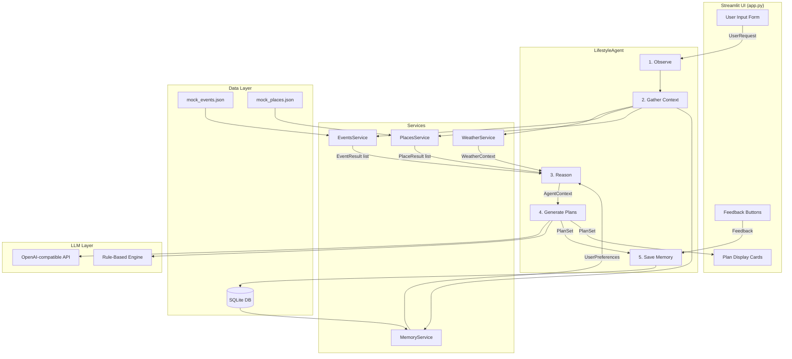
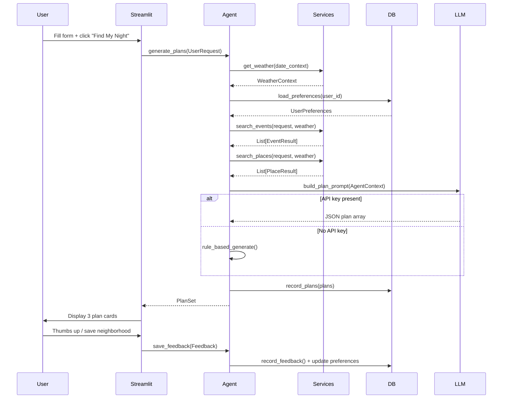

# Architecture

## System Diagram

## Data Flow

## Component Responsibilities

| Component | Responsibility |
|-----------|---------------|
| `app.py` | UI rendering, session state, user input collection |
| `LifestyleAgent` | Orchestrates the full agent loop |
| `WeatherService` | Returns seasonal Chicago weather context |
| `EventsService` | Filters and scores mock events by user request |
| `PlacesService` | Filters and scores mock venues/restaurants |
| `MemoryService` | Read/write interface to SQLite |
| `database.py` | Raw SQLite helpers (no ORM) |
| `schemas.py` | Pydantic models for all data structures |
| `prompts.py` | LLM prompt assembly |

## Key Design Decisions

**No ORM** — SQLite is accessed directly for simplicity. At MVP scale this is faster to read and debug.

**Pydantic models everywhere** — All inter-component data uses typed Pydantic models, catching errors early.

**LLM is optional** — The rule-based fallback produces good plans without any API dependency, making the app always runnable.

**Score-based filtering** — Events and places are scored against the request (neighborhood, vibe, interests, group, budget, energy) rather than hard-filtered, ensuring results even with sparse matches.
