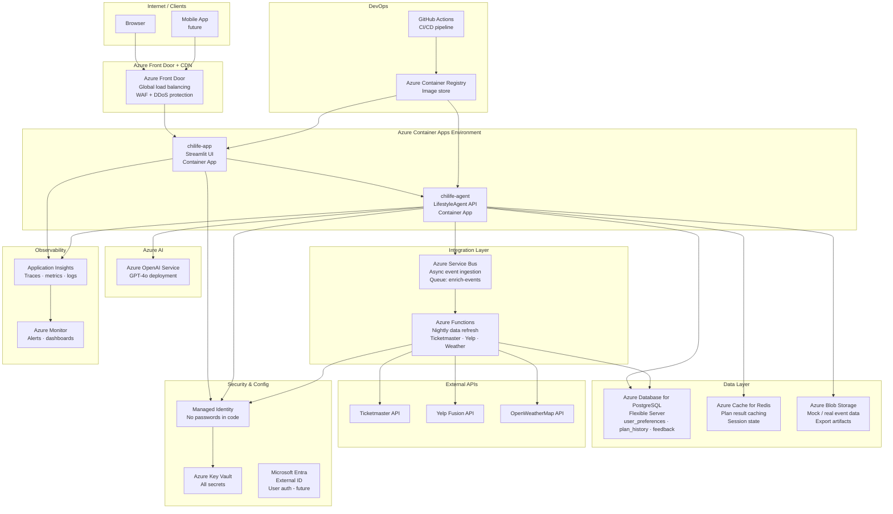
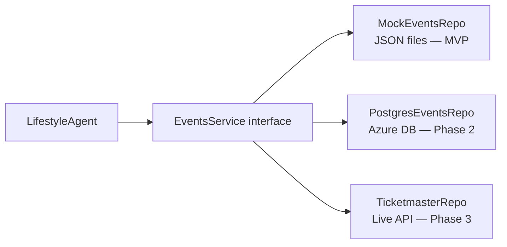
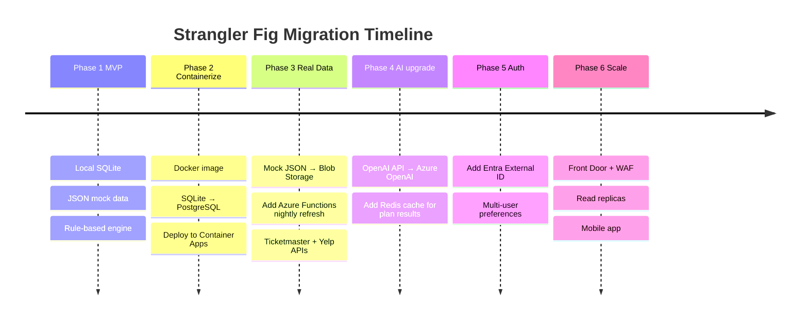
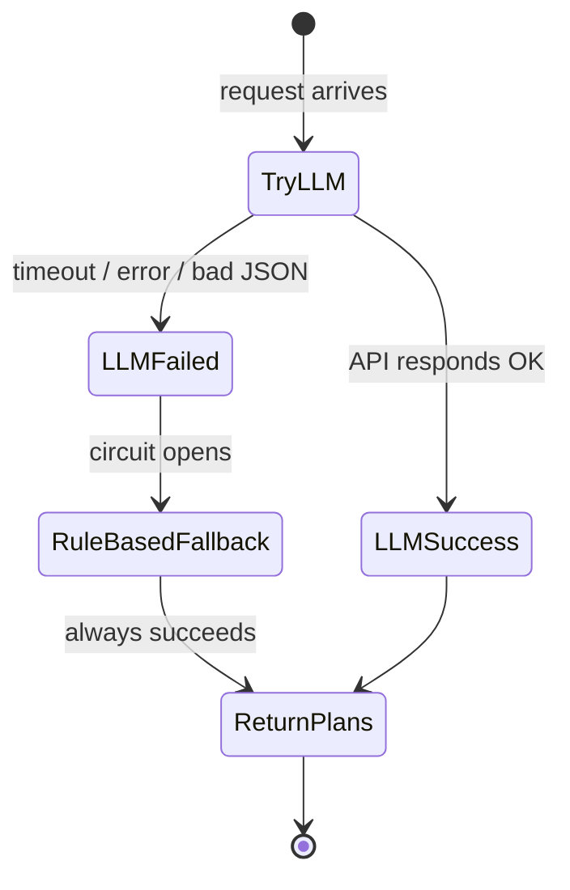
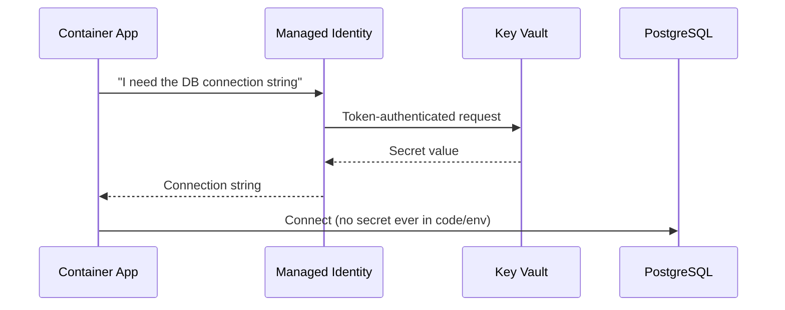
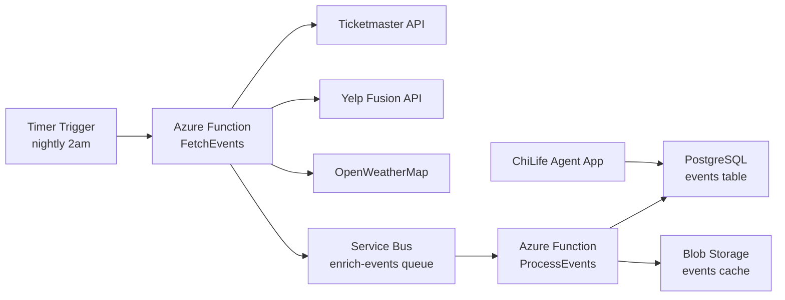
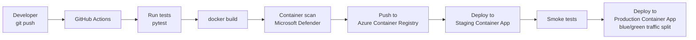

# Azure Architecture — ChiLife Agent

This document describes the target cloud architecture for ChiLife Agent on Azure,
the design patterns it applies, and the step-by-step migration path from the local MVP.

---

## Target Architecture Overview



---

## Azure Services Mapping

| MVP Component | Azure Service | Why |
|---------------|--------------|-----|
| `streamlit run app.py` | Azure Container Apps | Serverless containers, auto-scale to zero, no VM management |
| SQLite file | Azure Database for PostgreSQL Flexible Server | Managed, HA, backups, connection pooling via PgBouncer |
| In-memory session state | Azure Cache for Redis | Shared state across container replicas |
| `mock_events.json` | Azure Blob Storage | Scalable, versioned, replicated data files |
| OpenAI client | Azure OpenAI Service | Data residency, private networking, no public internet for AI calls |
| `.env` file | Azure Key Vault + Managed Identity | Zero-secret-in-code, automatic rotation |
| `print()` logs | Azure Application Insights | Distributed tracing, query logs, set alerts |
| Manual data updates | Azure Functions + Service Bus | Scheduled nightly data refresh from real APIs |
| GitHub | GitHub Actions + Azure Container Registry | Full CI/CD pipeline |

---

## Design Patterns Applied

### 1. 12-Factor App

The most important pattern for cloud readiness. All 12 factors are addressed:

| Factor | How ChiLife Agent handles it |
|--------|------------------------------|
| Codebase | Single repo, one app |
| Dependencies | `requirements.txt`, Docker image |
| **Config** | `src/config.py` reads all settings from env vars — no hardcoded values |
| Backing services | DB, Redis, Blob treated as attached resources via URL in env |
| Build/release/run | GitHub Actions builds image → ACR → Container Apps deploys |
| Processes | Stateless containers — session state in Redis, data in PostgreSQL |
| Port binding | Streamlit binds to `$PORT` / 8501 |
| Concurrency | Scale out via Container Apps replicas |
| Disposability | Fast startup, graceful shutdown |
| Dev/prod parity | Same Docker image in local, staging, prod |
| Logs | Write to stdout → Application Insights collector |
| Admin processes | DB migrations as one-off container jobs |

### 2. Repository Pattern

The current service layer (`events_service.py`, `places_service.py`, `memory_service.py`)
already acts as a repository — it hides the data source from the agent.



**Migration path:** Add a `EVENTS_BACKEND=mock|postgres|ticketmaster` env var.
The service checks config and returns the right implementation. Agent code changes **zero lines**.

### 3. Strangler Fig Pattern

Never rewrite everything at once. Strangle the old system piece by piece.



At every phase, the existing functionality continues working — nothing is torn out all at once.

### 4. Circuit Breaker Pattern

Already implemented in `lifestyle_agent.py`. The agent always has a fallback:



On Azure, extend this to also handle PostgreSQL failures (fall back to Redis cache),
and Redis failures (fall back to in-memory).

### 5. Managed Identity (Zero-Trust Secrets)

Never store connection strings or API keys in environment variables directly in Azure.
Instead, use Managed Identity to pull secrets from Key Vault at runtime.



In code, `config.py` reads `DATABASE_URL` from env. In Azure Container Apps,
that env var is a **Key Vault reference** (`@Microsoft.KeyVault(SecretUri=...)`),
not the actual value. The platform resolves it automatically.

### 6. Event-Driven Data Enrichment

Real event data arrives asynchronously via Azure Service Bus so the app
is never blocked waiting for external API calls:



The app reads from PostgreSQL — it never calls external APIs directly.
This keeps response times fast and isolates external API failures.

---

## CI/CD Pipeline



**Blue/Green on Container Apps:** Traffic is split — 10% to new revision,
90% to old. If error rate is low, shift to 100% new. One-click rollback.

---

## Infrastructure as Code

All Azure resources should be defined in code, not clicked through the portal.
Two options:

| Tool | When to use |
|------|------------|
| **Bicep** | Azure-native, no state file, great for greenfield Azure projects |
| **Terraform** | Multi-cloud, large teams, existing Terraform expertise |

Recommended file structure:
```
infra/
  main.bicep               # Resource group, shared resources
  modules/
    container-apps.bicep   # App + Agent container apps
    database.bicep         # PostgreSQL flexible server
    redis.bicep            # Azure Cache for Redis
    keyvault.bicep         # Key Vault + access policies
    openai.bicep           # Azure OpenAI deployment
    monitoring.bicep       # Application Insights + Log Analytics
```

---

## Cost Estimate (MVP Cloud)

| Service | SKU | Est. Monthly |
|---------|-----|-------------|
| Container Apps (app + agent) | Consumption plan | $10–30 |
| PostgreSQL Flexible Server | Burstable B1ms | $15 |
| Azure Cache for Redis | C0 Basic | $16 |
| Azure OpenAI | Pay-per-token (gpt-4o-mini) | $5–20 |
| Container Registry | Basic | $5 |
| Key Vault | Standard | $1 |
| Application Insights | Pay-per-GB | $2–5 |
| **Total estimate** | | **~$54–92/month** |

Scales to ~$0 during idle periods with Container Apps consumption plan (scale-to-zero).
